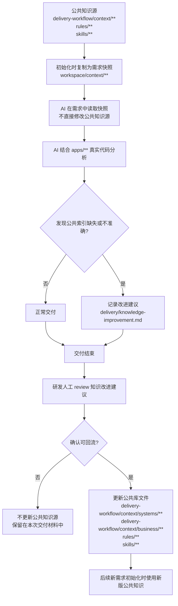
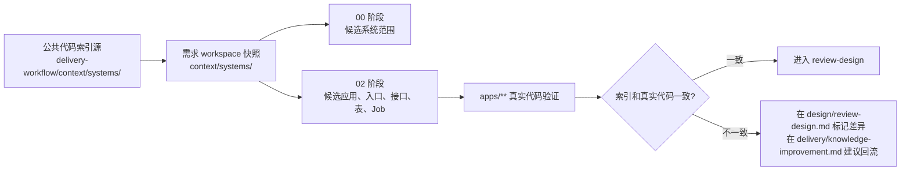

# Delivery Workflow 交流说明初稿

## 1. 背景

`delivery-workflow` 是一套面向 AI 辅助需求交付的轻量工作流脚手架。它的目标不是让 AI 一次性完成所有开发，而是把需求澄清、技术设计、人工确认、任务拆解、单任务实现、代码 review 和交付总结拆成可控制、可复核的阶段。

在实际跑需求时，当前流程整体可用，但也暴露出一个明显问题：初始化文件和阶段产物过多。AI 和研发都需要在多个目录、多个文件之间切换，容易出现“文件存在但阶段含义不清”“上一阶段产物名和下一阶段输入名对不上”“确认事项分散”等问题。

本次优化的核心目标是：保留流程控制力，减少初始化噪音，让每个阶段只产出少数关键文件。

## 2. 优化目标

本次优化主要围绕以下几点：

- 初始化目录更少，只保留需求交付真正需要长期存在的目录。
- 产品资料和 AI 产物分离：`prd/` 只放原始资料，AI 分析结果统一放到 `design/`、`tasks/`、`review/`、`delivery/`。
- 合并阶段产物，避免 01、02 阶段一次生成过多文件。
- 命令文件从根目录移到 `.workflow/commands/`，降低 workspace 干扰。
- 公共 `rules/` 和 `skills/` 都作为上下文快照复制到 `context/`。
- 保留强制人工 checkpoint，避免需求不清、技术边界不清或任务未确认时直接编码。

## 3. Workspace 目录结构

初始化后的 workspace 顶层结构如下：

```text
workspace/
  AGENTS.md
  CLAUDE.md
  .workflow/
    commands/
  prd/
    assets/
    templates/
    examples/
    references/
  apps/
  context/
    knowledge-version.md
    rules/
    skills/
    business/
    systems/
  design/
  tasks/
  review/
  delivery/
```

目录职责：

| 目录 | 职责 |
| --- | --- |
| `prd/` | 存放产品 PRD、附件、截图、Excel 模板、示例数据、补充资料。 |
| `apps/` | 存放本次需求确认涉及的应用 worktree 或 symlink。 |
| `context/` | 存放本次需求使用的公共规则、技能、业务术语、系统索引快照。 |
| `design/` | 存放上下文摘要、需求确认、评审版技术设计、实施技术方案、技术确认事项。 |
| `tasks/` | 存放实施任务拆解。 |
| `review/` | 存放实现 change log、self-check、AI code review。 |
| `delivery/` | 存放最终交付总结和知识改进建议。 |
| `.workflow/commands/` | 存放阶段命令模板。属于脚手架机制，不是需求交付产物。 |

## 4. 阶段流程

当前方案保留原有阶段控制：

```text
00-load-context
  -> 01-clarify-requirement
  -> 02-generate-review-design
  -> human technical review
  -> human app scope confirmation
  -> app worktree preparation
  -> 04-generate-implementation-design
  -> 05-split-tasks
  -> human task confirmation
  -> 06-implement-task
  -> 07-review-code
  -> 08-delivery-summary
```

各阶段关键产物：

| 阶段 | 目标 | 主要产物 |
| --- | --- | --- |
| `00-load-context` | 读取 PRD 和公共上下文，形成需求背景摘要。 | `design/context-summary.md` |
| `01-clarify-requirement` | 梳理需求摘要、验收标准、产品待确认项。 | `design/requirement-confirmation.md` |
| `02-generate-review-design` | 基于真实代码分析技术边界、字段映射、接口候选和校验规则。 | `design/review-design.md`、`design/technical-confirmation.md` |
| `04-generate-implementation-design` | 在应用范围确认后形成实施级技术方案。 | `design/implementation-design.md` |
| `05-split-tasks` | 将实施方案拆成可独立 review 的任务。 | `tasks/task-list.md` |
| `06-implement-task` | 只实现一个已确认任务。 | `review/change-log.md`、`review/self-check.md` |
| `07-review-code` | 基于任务、方案和 diff 做 AI review。 | `review/ai-review.md` |
| `08-delivery-summary` | 总结交付结果和可回流知识。 | `delivery/delivery-summary.md`、`delivery/knowledge-improvement.md` |

## 5. 流程图

### 5.1 需求交付主流程

```mermaid
flowchart TD
    A["产品 PRD / 附件 / 模板<br/>prd/**"] --> B["初始化需求 workspace"]
    B --> C["复制公共上下文快照<br/>context/rules<br/>context/skills<br/>context/business<br/>context/systems"]
    C --> D["00 加载上下文<br/>生成 design/context-summary.md"]
    D --> E["AI 调用 context 中的 rules / skills<br/>解析 PRD、模板、示例和业务规则"]
    E --> F["01 需求澄清<br/>生成 design/requirement-confirmation.md"]
    F --> G{"人工确认需求口径"}
    G -->|未确认| F
    G -->|已确认 / 按假设继续| H["准备本次涉及应用<br/>apps/**"]
    H --> I["AI 读取公共代码索引快照<br/>context/systems/**"]
    I --> J["AI 结合 apps 下真实代码校验索引<br/>Controller / Service / Job / Handler / Mapper / Table"]
    J --> K["02 评审版技术设计<br/>生成 design/review-design.md<br/>生成 design/technical-confirmation.md"]
    K --> L{"人工确认技术边界和应用范围"}
    L -->|未确认| K
    L -->|确认| M["04 实施技术方案<br/>design/implementation-design.md"]
    M --> N["05 任务拆解<br/>tasks/task-list.md"]
    N --> O{"人工确认任务"}
    O -->|未确认| N
    O -->|确认单个任务| P["06 实施单任务<br/>review/change-log.md<br/>review/self-check.md"]
    P --> Q["07 AI 代码 review<br/>review/ai-review.md"]
    Q --> R["08 交付总结<br/>delivery/delivery-summary.md<br/>delivery/knowledge-improvement.md"]
```



### 5.2 公共知识和索引回流流程



### 5.3 代码索引调用关系



## 6. 关键合并点

### 5.1 需求阶段产物合并

原先 01 阶段会拆分输出：

```text
requirement/requirement-summary.md
requirement/open-questions.md
requirement/acceptance-criteria.md
requirement/clarification-confirmation.md
```

当前方案合并为：

```text
design/requirement-confirmation.md
```

合并后，这个文件同时承载需求摘要、验收标准、待确认事项和人工确认结果。这样研发只需要看一个文件就能判断需求阶段是否完成。

### 5.2 技术边界阶段产物合并

原先 02 阶段会拆分输出：

```text
design/technical-boundary-analysis.md
design/field-mapping.md
design/interface-candidates.md
design/validation-rules.md
design/technical-confirmation.md
```

当前方案合并为：

```text
design/review-design.md
design/technical-confirmation.md
```

其中 `review-design.md` 放技术分析内容，`technical-confirmation.md` 只放需要人工确认的技术边界。这样既保留技术证据，又减少文件切换。

### 5.3 Review 和交付产物分离

当前方案中，`review/` 只承载实现后的自检和代码 review：

```text
review/change-log.md
review/self-check.md
review/ai-review.md
```

最终交付结果独立放在 `delivery/`：

```text
delivery/delivery-summary.md
delivery/knowledge-improvement.md
```

这样可以避免“代码 review 结果”和“最终交付结果”混在一个目录里。

## 7. 人工 Checkpoint

当前方案仍然保留以下强制暂停点：

- 需求澄清完成后，必须等待产品/研发确认。
- 评审版技术设计完成后，必须等待技术确认。
- 应用范围确认后，才能准备 `apps/` 下的应用 worktree。
- 任务拆解完成后，必须等待任务确认。

如果发现以下情况，AI 必须暂停：

- 涉及数据库表结构变更。
- 涉及金额、费用、报价、账单、结算、应付、清分逻辑。
- 涉及跨应用接口请求或响应变化。
- 需要删除已有行为。
- 涉及共享组件变更。
- 真实代码和评审设计不一致。
- 需要修改未确认应用。
- 应用、表、MQ、Job 或外部依赖归属不清。

## 8. 推荐交互方式

### 7.1 初始化后

研发把 PRD 和附件放入：

```text
prd/
```

然后让 AI 执行：

```text
Read AGENTS.md and execute .workflow/commands/00-load-context.md
```

### 7.2 产品确认阶段

AI 生成 `design/requirement-confirmation.md` 后，研发不要在对话里零散确认，建议直接让 AI 把确认结果写回该文件。

推荐表达：

```text
当前仍处于 01 需求澄清确认阶段，不要读取 apps，不要写技术方案。
请把以下人工确认结果更新到 design/requirement-confirmation.md。
```

### 7.3 技术确认阶段

AI 生成 `design/review-design.md` 和 `design/technical-confirmation.md` 后，研发可以定义 handler、接口、模板路径、应用范围等技术边界，但仍不进入编码。

推荐表达：

```text
当前处于 02 技术边界确认阶段，不要修改代码，不要进入实现。
请把以下技术边界确认结果更新到 design/technical-confirmation.md。
具体类名、枚举值、接口路径如果需要结合代码再确认，请放到 04 实施技术方案阶段细化。
```

## 9. 共建知识与索引

代码索引结果集建议放在公共脚手架的 `delivery-workflow/context/systems/` 下，由团队共建维护。初始化 workspace 时，这些公共索引会被复制成当前需求的上下文快照，落到需求 workspace 的 `context/systems/` 下。

当前已有结构：

```text
delivery-workflow/context/systems/
  app-category.yml
  app-index-lite.yml
  repo-index.yml
  apps/
    yl-jms-finance-export.md
    yl-jms-spm-core-export-api.md
    yl-jms-spm-value-added-api.md
    yl-web-financialmanagement.md
    yl-web-ft-export.md
```

建议后续逐步补齐：

| 索引类型 | 建议位置 | 内容 |
| --- | --- | --- |
| 应用索引 | `context/systems/app-index-lite.yml`、`context/systems/apps/*.md` | 应用职责、所属域、常见入口、主要依赖、风险提示。 |
| 仓库索引 | `context/systems/repo-index.yml` | 仓库名、路径、应用类型、主要模块、构建方式。 |
| 代码入口索引 | `context/systems/apps/*.md` | Controller、Job、MQ、导入导出 handler、核心 Service、Feign client。 |
| 库表索引 | `context/systems/tables/*.md` 或 `context/systems/table-index.yml` | 表职责、主键、关键字段、金额字段、状态字段、所属应用、常见查询入口。 |
| 跨应用依赖索引 | `context/systems/dependencies.yml` | Feign、MQ、Job、导入导出、文件服务等跨应用关系。 |

共建方式建议：

- `delivery-workflow/context/systems/` 是公共知识源，必须人工审核后更新。
- 单个需求 workspace 里的 `context/systems/` 是初始化时的快照，不直接代表公共最新知识。
- AI 在需求交付过程中发现索引缺失、字段缺失或应用职责不清时，不直接修改公共知识源。
- AI 应在交付阶段写入 `delivery/knowledge-improvement.md`，提出可回流的索引改进建议。
- 研发人工 review 后，再把确认过的信息补回 `delivery-workflow/context/systems/`。

库表索引建议单独作为后续重点建设项。尤其是金额、报价、账单、应付、清分、结算相关表，需要记录字段含义、状态流转、唯一性约束、金额口径、回刷风险和上下游应用。

## 10. 与成熟工具对比

这套 workflow 不定位为通用 AI 编程工具，也不定位为任务管理工具。它更像面向既有复杂业务系统的“AI 需求交付控制台”：先读 PRD 和公共知识，再用真实代码校验边界，经过人工确认后再拆任务和实现。

| 工具 / 方案 | 主要定位 | 优点 | 局限 | 我们这套的差异和优势 |
| --- | --- | --- | --- | --- |
| [GitHub Spec Kit](https://github.github.com/spec-kit/index.html) | 通用 Spec-Driven Development 工具链，核心流程是 Spec -> Plan -> Tasks -> Implement。 | 规格驱动清晰；模板、检查清单和跨阶段 Markdown 产物成熟；支持多种 AI coding agent；生态扩展能力强。 | 更偏通用项目/功能规格，不天然包含团队已有应用索引、库表索引、资损暂停规则和多应用技术边界确认。 | 我们可以借鉴它的“规格先行”和阶段产物思想，但更强调既有系统改造、真实代码入口校验、人工 checkpoint、公共知识回流。 |
| [Kiro Specs](https://kiro.dev/docs/specs/) | IDE 内的规格化开发流程，通常围绕 Requirements / Design / Tasks 三阶段。 | 交互体验好；任务执行状态可视化；能并行执行无依赖任务；适合 IDE 内完成复杂功能或 bugfix。 | 更依赖 IDE 产品形态；知识沉淀主要围绕当前项目 spec，不是团队级公共代码索引和库表索引体系。 | 我们后续做图形化界面时可以参考它的阶段面板和任务状态，但底层仍保留 markdown workspace 和公共知识快照。 |
| [Task Master](https://github.com/eyaltoledano/claude-task-master) | AI 任务管理系统，可从 PRD 解析任务，支持 MCP / CLI / 多编辑器。 | 任务拆解、next task、任务扩展、任务状态管理成熟；适合把 PRD 快速转成可执行 task list。 | 核心优势在任务管理，不负责复杂业务技术边界、应用范围确认、库表风险、跨应用接口确认和交付知识回流。 | 我们的任务拆解只是中后段；真正重点在任务拆解前的需求确认、技术边界确认、真实代码校验和资损风险暂停。 |
| [Aider](https://aider.chat/) | 终端里的 AI pair programming 工具，直接修改代码并支持 Git、lint、test。 | 编码执行力强；代码地图、Git 集成、自动提交、lint/test 反馈成熟；适合单仓库内快速改代码。 | 更偏“执行编码”和 pair programming，不提供完整的需求交付流程、人工确认表、公共知识共建和多应用范围控制。 | 我们可以把 Aider/Codex/Claude Code 视为 06 实施阶段的执行器；workflow 负责告诉执行器什么时候能改、改哪个任务、不能越界。 |
| [OpenHands](https://github.com/OpenHands/OpenHands) | 开源 AI 软件开发 agent 平台，提供 SDK、CLI、Local GUI、Cloud 等形态。 | Agent 平台能力强；支持本地 GUI、云端、SDK；适合构建和运行自动化开发 agent。 | 更像 agent 执行平台，不是专门为公司内部复杂业务交付制定的流程规范；需要额外接入团队知识、风险规则和确认机制。 | 我们可以借鉴它的 GUI / agent harness 思路，但当前重点是先把团队交付流程、公共索引和人工 checkpoint 固化。 |
| 通用项目管理工具 | Issue、看板、排期、责任人、状态流转。 | 协作和排期成熟；适合团队管理任务和进度。 | 通常不了解 PRD、代码、库表、导入导出、Job、资损风险，也不会帮 AI 约束实施边界。 | 我们不是替代项目管理工具，而是在“PRD 到可安全实施任务”之间补一层 AI 交付控制。 |

当前这套 workflow 的核心优势：

- 面向既有多应用系统，不是假设从零开发。
- 把 `context/systems/**` 代码索引、应用索引、后续库表索引作为团队共建资产。
- 要求 AI 用 `apps/**` 真实代码校验设计，不允许只凭 PRD 或索引拍板。
- 对金额、报价、账单、应付、清分、结算、DB 变更、跨应用接口设置强制暂停点。
- 每次交付结束通过 `delivery/knowledge-improvement.md` 形成可回流知识，逐步增强公共库。
- 兼容 Codex、Claude Code、Aider 等执行器，本身不绑定某一个 agent。

一句话总结：

```text
Spec Kit 强在通用规格驱动；
Task Master 强在任务管理；
Aider / OpenHands 强在编码执行和 agent 平台；
我们这套强在复杂既有业务系统里的安全交付、技术边界确认和团队知识沉淀。
```

资料来源：

- GitHub Spec Kit: https://github.github.com/spec-kit/index.html
- Kiro Specs: https://kiro.dev/docs/specs/
- Task Master: https://github.com/eyaltoledano/claude-task-master
- Aider: https://aider.chat/
- OpenHands: https://github.com/OpenHands/OpenHands

## 11. 当前状态

目前已完成脚手架级调整，并通过一次初始化验证。初始化后的 workspace 顶层目录为：

```text
.workflow/
apps/
context/
design/
delivery/
prd/
review/
tasks/
AGENTS.md
CLAUDE.md
```

后续如果团队认可该方向，可以继续补充：

- 标准交互话术示例。
- 一个完整需求从 00 到 08 的样例 workspace。
- 每个阶段的质量检查清单。
