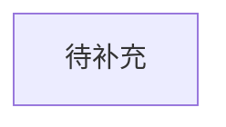

# {{需求名称}} 技术方案

## 一、相关文档

| 文档类型 | 文档名称 / 链接 | 备注 |
| --- | --- | --- |
| PRD |  |  |
| 需求澄清 | `design/process/requirement-confirmation.md` |  |
| 上下文摘要 | `design/process/context-summary.md` |  |

## 二、相关方

| 角色 | 姓名 / 团队 | 职责 | 确认结果 |
| --- | --- | --- | --- |
| 产品 |  | 需求口径确认 |  |
| 后端 |  | 技术方案与实现 |  |
| 前端 |  | 页面与交互实现 |  |
| QA |  | 测试范围与验收 |  |

## 三、QA

| 问题 | 影响范围 | 结论 | 备注 |
| --- | --- | --- | --- |

## 四、定级

说明：

- 对标事故等级设置 P0、P1、P2、P3。
- P0、P1、P2 需求需要进行技术概要评审和 code review。

| 项目 | 结论 | 依据 |
| --- | --- | --- |
| 本需求定级 |  |  |
| 是否需要技术评审 |  |  |
| 是否需要 code review |  |  |

## 五、功能拆分及估时

| 模块 | 功能点 | 涉及应用 | 复杂度 | 预估工时 | 备注 |
| --- | --- | --- | --- | --- | --- |

## 六、实现方案

### 概述

### 系统设计图



### 服务间主要调用链路

### 详述

#### 1. 本次涉及范围

| 应用 | 是否涉及 | 依据 | 真实代码证据 | 风险 |
| --- | --- | --- | --- | --- |

#### 2. 真实代码入口

| 应用 | 文件 | 类 / 方法 | 用途 | 备注 |
| --- | --- | --- | --- | --- |

#### 3. 可复用能力

#### 4. 新增或扩展能力

#### 5. 字段映射

| 业务字段 / 模板字段 | 代码字段 | 是否必填 | 字段类型 | 校验规则 | 代码依据 | 状态 |
| --- | --- | --- | --- | --- | --- | --- |

#### 6. 校验规则

| 场景 | 校验规则 | 错误提示 / 处理方式 | 代码依据 |
| --- | --- | --- | --- |

#### 7. 实现步骤建议

## 七、风险预估

### 系统指标风险

| 风险项 | 影响范围 | 风险等级 | 评估结论 | 应对策略 |
| --- | --- | --- | --- | --- |

### 功能和系统风险

| 风险项 | 影响范围 | 风险等级 | 评估结论 | 应对策略 |
| --- | --- | --- | --- | --- |

## 八、重要组件

说明：

- MySQL / Mongo 可在数据库部分填写。
- Redis 需要写明实例、key、数据结构、过期时间等。
- 消息中间件需写明 topic、生产者服务、消费者服务、即时 / 延时消息、下游是否幂等及其他。

| 组件类型 | 名称 | 用途 | 关键配置 | 风险 / 备注 |
| --- | --- | --- | --- | --- |
| MySQL |  |  |  |  |
| Mongo |  |  |  |  |
| Redis |  |  |  |  |
| MQ |  |  |  |  |
| Job |  |  |  |  |

## 九、其他

### 研发协作方案

| 应用 | 基准分支 | 建议开发分支 | 提交信息建议 | 备注 |
| --- | --- | --- | --- | --- |

### 其他说明

## 十、数据库设计及脚本

### 表结构变更

```sql
-- 如无数据库变更，写明：本次无数据库变更。
```

### 数据迁移 / 初始化脚本

```sql
-- 如无数据脚本，写明：本次无数据迁移或初始化脚本。
```

### 数据兼容说明

## 十一、接口定义及请求示例

### 接口清单

| 接口名称 | 请求方式 | 接口路径 | 新增 / 变更 | 说明 |
| --- | --- | --- | --- | --- |

### 接口详情

#### 接口名称

- 方法 / 路径：
- Content-Type：
- 说明：

请求参数：

| 参数 | 类型 | 是否必填 | 说明 |
| --- | --- | --- | --- |

请求示例：

```json
{}
```

响应参数：

| 参数 | 类型 | 说明 |
| --- | --- | --- |

响应示例：

```json
{}
```

规则说明：

## 十二、回滚措施 / 故障预案

若有问题，默认回滚为上一个稳定版本。如果有特殊回滚策略和故障预案，请结合发布顺序补充。

| 场景 | 回滚措施 | 数据处理 | 验证方式 | 负责人 |
| --- | --- | --- | --- | --- |

## 十三、待人工确认项

| 编号 | 确认项 | 影响范围 | AI 推荐结论 | 确认结果 |
| --- | --- | --- | --- | --- |
